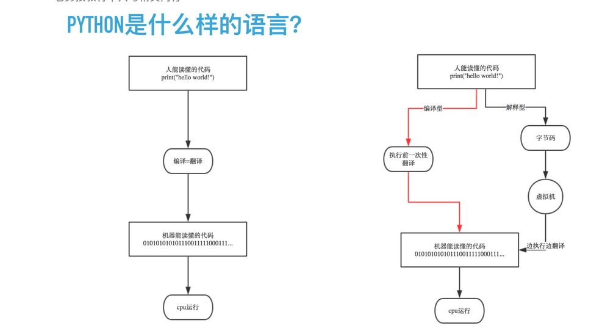
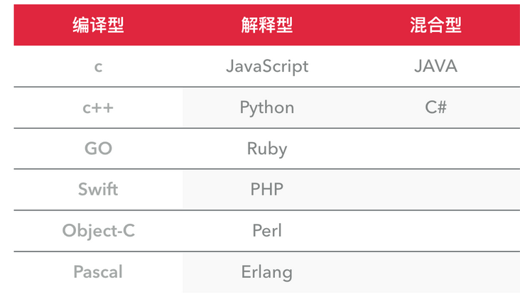

[TOC]

## 一，Python介绍


### 1. python的出生与应用

　　python的创始人为吉多·范罗苏姆（Guido van Rossum）。1989年的圣诞节期间，吉多·范罗苏姆（中文名字：龟叔）为了在阿姆斯特丹打发时间，决心开发一个新的脚本解释程序，作为ABC语言的一种继承。 

Python可以应用于众多领域，如：数据分析、组件集成、网络服务、图像处理、数值计算和科学计算等众多领域。目前业内几乎所有大中型互联网企业都在使用Python，如：Youtube、Dropbox、BT、Quora（中国知乎）、豆瓣、知乎、Google、Yahoo!、Facebook、NASA、百度、腾讯、汽车之家、美团等。

**目前Python主要应用领域：**

- **云计算**: 云计算最火的语言， 典型应用OpenStack
- **WEB开发**: 众多优秀的WEB框架，众多大型网站均为Python开发，Youtube, Dropbox, 豆瓣。。。， 典型WEB框架有Django
- **科学运算、人工智能**: 典型库NumPy, SciPy, Matplotlib, Enthought librarys,pandas
- **系统运维**: 运维人员必备语言
- **金融**：量化交易，金融分析，在金融工程领域，Python不但在用，且用的最多，而且重要性逐年提高。原因：作为动态语言的Python，语言结构清晰简单，库丰富，成熟稳定，科学计算和统计分析都很牛逼，生产效率远远高于c,c++,java,尤其擅长策略回测
- **图形GUI**: PyQT, WxPython,TkInter


### 2. python是什么编程语言。

*编程语言主要从以下几个角度为进行分类，编译型和解释型、静态语言和动态语言、强类型定义语言和弱类型定义语言，每个分类代表什么意思呢，我们一起来看一下。*


#### 2.1 编译型与解释型

**编译器**是把源程序的每一条语句都编译成机器语言,并保存成二进制文件,这样运行时计算机可以直接以机器语言来运行此程序,速度很快; 

而**解释器**则是只在执行程序时,才一条一条的解释成机器语言给计算机来执行,所以运行速度是不如编译后的程序运行的快的. 

这是因为计算机不能直接认识并执行我们写的语句,它只能认识机器语言(是二进制的形式)


 

 


**编译型**
优点：编译器一般会有预编译的过程对代码进行优化。因为编译只做一次，运行时不需要编译，所以编译型语言的程序执行效率高。可以脱离语言环境独立运行。
缺点：编译之后如果需要修改就需要整个模块重新编译。编译的时候根据对应的运行环境生成机器码，不同的操作系统之间移植就会有问题，需要根据运行的操作系统环境编译不同的可执行文件。

**解释型**
优点：有良好的平台兼容性，在任何环境中都可以运行，前提是安装了解释器（虚拟机）。灵活，修改代码的时候直接修改就可以，可以快速部署，不用停机维护。

缺点：每次运行的时候都要解释一遍，性能上不如编译型语言。

#### 2.2 动态语言和静态语言

通常我们所说的动态语言、静态语言是指动态类型语言和静态类型语言。

（1）动态类型语言：动态类型语言是指在运行期间才去做数据类型检查的语言，也就是说，在用动态类型的语言编程时，永远也不用给任何变量指定数据类型，该语言会在你第一次赋值给变量时，在内部将数据类型记录下来。Python和Ruby就是一种典型的动态类型语言，其他的各种脚本语言如VBScript也多少属于动态类型语言。

（2）静态类型语言：静态类型语言与动态类型语言刚好相反，它的数据类型是在编译其间检查的，也就是说在写程序时要声明所有变量的数据类型，C/C++是静态类型语言的典型代表，其他的静态类型语言还有C#、JAVA等。


#### 2.3 强类型定义语言和弱类型定义语言

（1）强类型定义语言：强制数据类型定义的语言。也就是说，一旦一个变量被指定了某个数据类型，如果不经过强制转换，那么它就永远是这个数据类型了。举个例子：如果你定义了一个整型变量a,那么程序根本不可能将a当作字符串类型处理。强类型定义语言是类型安全的语言。

（2）弱类型定义语言：数据类型可以被忽略的语言。它与强类型定义语言相反, 一个变量可以赋不同数据类型的值。

强类型定义语言在速度上可能略逊色于弱类型定义语言，但是强类型定义语言带来的严谨性能够有效的避免许多错误。另外，“这门语言是不是动态语言”与“这门语言是否类型安全”之间是完全没有联系的！
例如：Python是动态语言，是强类型定义语言（类型安全的语言）; VBScript是动态语言，是弱类型定义语言（类型不安全的语言）; JAVA是静态语言，是强类型定义语言（类型安全的语言）。

通过上面这些介绍，我们可以得出，**python是一门动态解释性的强类型定义语言。**


### 3. python的优缺点

先看优点

1. Python的定位是“优雅”、“明确”、“简单”，所以Python程序看上去总是简单易懂，初学者学Python，不但入门容易，而且将来深入下去，可以编写那些非常非常复杂的程序。
2. 开发效率非常高，Python有非常强大的第三方库，基本上你想通过计算机实现任何功能，Python官方库里都有相应的模块进行支持，直接下载调用后，在基础库的基础上再进行开发，大大降低开发周期，避免重复造轮子。
3. 高级语言————当你用Python语言编写程序的时候，你无需考虑诸如如何管理你的程序使用的内存一类的底层细节
4. 可移植性————由于它的开源本质，Python已经被移植在许多平台上（经过改动使它能够工 作在不同平台上）。如果你小心地避免使用依赖于系统的特性，那么你的所有Python程序无需修改就几乎可以在市场上所有的系统平台上运行
5. 可扩展性————如果你需要你的一段关键代码运行得更快或者希望某些算法不公开，你可以把你的部分程序用C或C++编写，然后在你的Python程序中使用它们。
6. 可嵌入性————你可以把Python嵌入你的C/C++程序，从而向你的程序用户提供脚本功能。

再看缺点：

1. 速度慢，Python 的运行速度相比C语言确实慢很多，跟JAVA相比也要慢一些，因此这也是很多所谓的大牛不屑于使用Python的主要原因，但其实这里所指的运行速度慢在大多数情况下用户是无法直接感知到的，必须借助测试工具才能体现出来，比如你用C运一个程序花了0.01s,用Python是0.1s,这样C语言直接比Python快了10倍,算是非常夸张了，但是你是无法直接通过肉眼感知的，因为一个正常人所能感知的时间最小单位是0.15-0.4s左右，哈哈。其实在大多数情况下Python已经完全可以满足你对程序速度的要求，除非你要写对速度要求极高的搜索引擎等，这种情况下，当然还是建议你用C去实现的。
2. 代码不能加密，因为PYTHON是解释性语言，它的源码都是以名文形式存放的，不过我不认为这算是一个缺点，如果你的项目要求源代码必须是加密的，那你一开始就不应该用Python来去实现。
3. 线程不能利用多CPU问题，这是Python被人诟病最多的一个缺点，GIL即全局解释器锁（Global Interpreter Lock），是[计算机程序设计语言](http://zh.wikipedia.org/wiki/计算机程序设计语言)[解释器](http://zh.wikipedia.org/wiki/解释器)用于[同步](http://zh.wikipedia.org/wiki/同步)[线程](http://zh.wikipedia.org/wiki/线程)的工具，使得任何时刻仅有一个线程在执行，Python的线程是操作系统的原生线程。在Linux上为pthread，在Windows上为Win thread，完全由操作系统调度线程的执行。一个python解释器进程内有一条主线程，以及多条用户程序的执行线程。即使在多核CPU平台上，由于GIL的存在，所以禁止多线程的并行执行。关于这个问题的折衷解决方法，我们在以后线程和进程章节里再进行详细探讨。

当我们编写Python代码时，我们得到的是一个包含Python代码的以`.py`为扩展名的文本文件。要运行代码，就需要Python解释器去执行`.py`文件。

由于整个Python语言从规范到解释器都是开源的，所以理论上，只要水平够高，任何人都可以编写Python解释器来执行Python代码（当然难度很大）。事实上，确实存在多种Python解释器。


### 4. python的种类。

**CPython**

当我们从[Python官方网站](https://www.python.org/)下载并安装好Python 3.6后，我们就直接获得了一个官方版本的解释器：CPython。这个解释器是用C语言开发的，所以叫CPython。在命令行下运行`python`就是启动CPython解释器。

CPython是使用最广的Python解释器。教程的所有代码也都在CPython下执行。

**小结：**

　　Python的解释器很多，但使用最广泛的还是CPython。如果要和Java或.Net平台交互，最好的办法不是用Jython或IronPython，而是通过网络调用来交互，确保各程序之间的独立性。


## 二. python环境


​                           

## 三. python基础初识。


###  1. 运行python代码。

在d盘下创建一个t1.py文件内容是：

```python
print('hello world')
```

打开windows命令行输入cmd，确定后 写入代码python d:t1.py 

> python *.py


### 2. 解释器。

上一步中执行 python d:t1.py 时，明确的指出 t1.py 脚本由 python 解释器来执行。

如果想要类似于执行shell脚本一样执行python脚本，例： `./t1.py `，那么就需要在 hello.py 文件的头部指定解释器，如下：

```python
#!/usr/bin/env python
print` `"hello,world"
```

如此一来，执行： .`/t1.py` 即可。

ps：执行前需给予t1.py 执行权限，chmod 755 t1.py


### 3. 注释。

当行注释：**# 被注释内容**

多行注释：**'''被注释内容'''**，或者**"""被注释内容"""**


### 4. 变量

变量是什么？  变量：把程序运行的中间结果临时的存在内存里，以便后续的代码调用。


#### 4.1、声明变量

```python
lux = '鲁迅本人'
```

上述代码声明了一个变量，变量名为： lux，变量name的值为："鲁迅本人"

变量的作用：昵称，**其代指内存里某个地址中保存的内容**


#### 4.2、变量定义的规则：

- 变量名只能是 字母、数字或下划线的任意组合
- 变量名的第一个字符不能是数字
- 以下关键字不能声明为变量名
  ['and', 'as', 'assert', 'break', 'class', 'continue', 'def', 'del', 'elif', 'else', 'except', 'exec', 'finally', 'for', 'from', 'global', 'if', 'import', 'in', 'is', 'lambda', 'not', 'or', 'pass', 'print', 'raise', 'return', 'try', 'while', 'with', 'yield']
- 变量的定义要具有可描述性。


#### 4.3、推荐定义方式

```python
#驼峰体

AgeOfOldboy = 56

NumberOfStudents = 80

#下划线

age_of_oldboy = 56

number_of_students = 80
```

> 你觉得哪种更清晰，哪种就是官方推荐的，我想你肯定会先第2种,第一种AgeOfOldboy咋一看以为是AngelaBaby

#### 4.4、变量的赋值

```python
lux = '鲁迅本人'、
name = '太白金星'
```


```python
name1 = '太白金星'
name2 = name1
name3 = name2
```


#### 4.5、定义变量不好的方式举例

- 变量名为中文、拼音
- 变量名过长
- 变量名词不达意


### 5. 常量

常量即指不变的量，如pai 3.141592653..., 或在程序运行过程中不会改变的量

举例，假如老男孩老师的年龄会变，那这就是个变量，但在一些情况下，他的年龄不会变了，那就是常量。在Python中没有一个专门的语法代表常量，程序员约定俗成用变量名全部大写代表常量

```python
AGE_OF_OLDBOY = 56
```

> 在c语言中有专门的常量定义语法，`const int count = 60;`一旦定义为常量，更改即会报错


### 6. 基础数据类型（初始）。

什么是数据类型？

　　我们人类可以很容易的分清数字与字符的区别，但是计算机并不能呀，计算机虽然很强大，但从某种角度上看又很傻，除非你明确的告诉它，1是数字，“汉”是文字，否则它是分不清1和‘汉’的区别的，因此，在每个编程语言里都会有一个叫数据类型的东东，其实就是对常用的各种数据类型进行了明确的划分，你想让计算机进行数值运算，你就传数字给它，你想让他处理文字，就传字符串类型给他。Python中常用的数据类型有多种，今天我们暂只讲3种， 数字、字符串、布尔类型


#### 6.1、整数类型（int）。

int（整型）

在32位机器上，整数的位数为32位，取值范围为-2**31～2**31-1，即-2147483648～2147483647

在64位系统上，整数的位数为64位，取值范围为-2**63～2**63-1，即-9223372036854775808～9223372036854775807

> 除了int之外， 其实还有float浮点型, 复数型，但今天先不讲啦


#### 6.2、字符串类型（str）。

在Python中,加了引号的字符都被认为是字符串！


```python
>>> name = "Alex Li" #双引号
>>> age = "22"       #只要加引号就是字符串
>>> age2 = 22          #int
>>> 
>>> msg = '''My name is taibai, I am 22 years old!'''  #我擦，3个引号也可以
>>> 
>>> hometown = 'ShanDong'   #单引号也可以
```


那单引号、双引号、多引号有什么区别呢？ 让我大声告诉你，单双引号木有任何区别，只有下面这种情况 你需要考虑单双的配合

```python
msg = "My name is Alex , I'm 22 years old!"
```

多引号什么作用呢？作用就是多行字符串必须用多引号

```python
msg = '''
今天我想写首小诗，
歌颂我的同桌，
你看他那乌黑的短发，
好像一只炸毛鸡。
'''
print(msg)
```

**字符串拼接**

数字可以进行加减乘除等运算，字符串呢？让我大声告诉你，也能？what ?是的，但只能进行"相加"和"相乘"运算。

```python
>>> name
'Alex Li'
>>> age
'22'
>>> 
>>> name + age  #相加其实就是简单拼接
'Alex Li22'
>>> 
>>> name * 10 #相乘其实就是复制自己多少次，再拼接在一起
'Alex LiAlex LiAlex LiAlex LiAlex LiAlex LiAlex LiAlex LiAlex LiAlex Li'
```

注意，字符串的拼接只能是双方都是字符串，不能跟数字或其它类型拼接

```python
>>> type(name),type(age2)
(<type 'str'>, <type 'int'>)
>>> 
>>> name
'Alex Li'
>>> age2
22
>>> name + age2
Traceback (most recent call last):
  File "<stdin>", line 1, in <module>
TypeError: cannot concatenate 'str' and 'int' objects #错误提示数字 和 字符 不能拼接
```


#### 6.3、布尔值（True，False）。

布尔类型很简单，就两个值 ，一个True(真)，一个False(假), 主要用记逻辑判断

但其实你们并不明白对么？ let me explain, 我现在有2个值 ， a=3, b=5 , 我说a>b你说成立么? 我们当然知道不成立，但问题是计算机怎么去描述这成不成立呢？或者说a< b是成立，计算机怎么描述这是成立呢？

没错，答案就是，用布尔类型


```python
>>> a=3
>>> b=5
>>> 
>>> a > b #不成立就是False,即假
False
>>> 
>>> a < b #成立就是True, 即真
True
```

####  

### 7. 程序交互

```python
#!/usr/bin/env python
# -*- coding: utf-8 -*-
  
# 将用户输入的内容赋值给 name 变量
name = input("请输入用户名：")
  
# 打印输入的内容
print(name)
```


执行脚本就会发现，程序会等待你输入姓名后再往下继续走。

可以让用户输入多个信息，如下

```python
#!/usr/bin/env python
# -*- coding: utf-8 -*-
name = input("What is your name?")
age = input("How old are you?")
hometown = input("Where is your hometown?")

print("Hello ",name , "your are ", age , "years old, you came from",hometown)
```


### 8. 流程控制之--if。

　　假如把写程序比做走路，那我们到现在为止，一直走的都是直路，还没遇到过分叉口，想象现实中，你遇到了分叉口，然后你决定往哪拐必然是有所动机的。你要判断那条岔路是你真正要走的路，如果我们想让程序也能处理这样的判断怎么办？ 很简单，只需要在程序里预设一些条件判断语句，满足哪个条件，就走哪条岔路。这个过程就叫流程控制。

if...else 语句

单分支

```python
if 条件:
    满足条件后要执行的代码
```

双分支

 

```python
"""
if 条件:
    满足条件执行代码
else:
    if条件不满足就走这段
"""
AgeOfOldboy = 48

if AgeOfOldboy > 50 :
    print("Too old, time to retire..")
else:
    print("还能折腾几年!")
```


缩进

> 这里必须要插入这个缩进的知识点

你会发现，上面的if代码里，每个条件的下一行都缩进了4个空格，这是为什么呢？这就是Python的一大特色，强制缩进，目的是为了让程序知道，每段代码依赖哪个条件，如果不通过缩进来区分，程序怎么会知道，当你的条件成立后，去执行哪些代码呢？

在其它的语言里，大多通过`{}`来确定代码块，比如C,C++,Java,Javascript都是这样，看一个JavaScript代码的例子


```javascript
var age = 56
if ( age < 50){
  console.log("还能折腾")
    console.log('可以执行多行代码')
}else{
   console.log('太老了')
}
```

 

在有`{}`来区分代码块的情况下，缩进的作用就只剩下让代码变的整洁了。

Python是门超级简洁的语言，发明者定是觉得用`{}`太丑了，所以索性直接不用它，那怎么能区分代码块呢？答案就是强制缩进。

Python的缩进有以下几个原则:

- 顶级代码必须顶行写，即如果一行代码本身不依赖于任何条件，那它必须不能进行任何缩进
- 同一级别的代码，缩进必须一致
- 官方建议缩进用4个空格，当然你也可以用2个，如果你想被人笑话的话。

多分支

回到流程控制上来，if...else ...可以有多个分支条件

 

```python
if 条件:
    满足条件执行代码
elif 条件:
    上面的条件不满足就走这个
elif 条件:
    上面的条件不满足就走这个
elif 条件:
    上面的条件不满足就走这个    
else:
    上面所有的条件不满足就走这段
```


写个猜年龄的游戏吧


```python
age_of_oldboy = 48

guess = int(input(">>:"))

if guess > age_of_oldboy :
    print("猜的太大了，往小里试试...")

elif guess < age_of_oldboy :
    print("猜的太小了，往大里试试...")

else:
    print("恭喜你，猜对了...")
```

上面的例子，根据你输入的值不同，会最多得到3种不同的结果

再来个匹配成绩的小程序吧，成绩有ABCDE5个等级，与分数的对应关系如下

```python
A    90-100
B    80-89
C    60-79
D    40-59
E    0-39
```

要求用户输入0-100的数字后，你能正确打印他的对应成绩

```python
score = int(input("输入分数:"))

if score > 100:
    print("我擦，最高分才100...")
elif score >= 90:
    print("A")
elif score >= 80:
    print("B")
elif score >= 60:
    print("C")
elif score >= 40:
    print("D")
else:
    print("太笨了...E")
```

这里有个问题，就是当我输入95的时候 ，它打印的结果是A,但是95 明明也大于第二个条件`elif score >=80:`呀, 为什么不打印B呢？这是因为代码是从上到下依次判断，只要满足一个，就不会再往下走啦，这一点一定要清楚呀！


### 9 数据类型转换

- 打印数据类型：:type(）
- 字符串转化成数字：int(str) 条件：str必须是数字组成的。
- 数字转化成字符串：str(int)