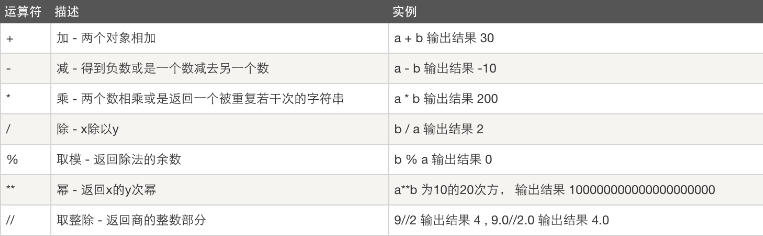
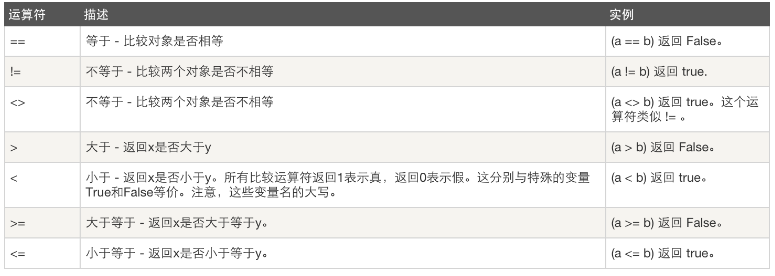
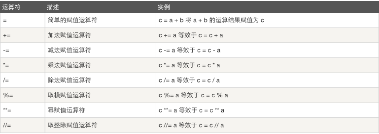
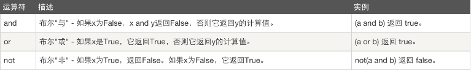
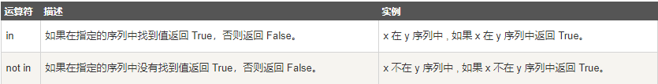

[TOC]

# Python基础二


## 一. 格式化输出

现有一练习需求，问用户的姓名、年龄、工作、爱好 ，然后打印成以下格式

```python
------------ info of 太白金星  -----------
Name  : 太白金星
Age   : 22
job   : Teacher
Hobbie: girl
------------- end -----------------
```

你怎么实现呢？你会发现，用字符拼接的方式还难实现这种格式的输出，所以一起来学一下新姿势

只需要把要打印的格式先准备好， 由于里面的 一些信息是需要用户输入的，你没办法预设知道，因此可以先放置个占位符，再把字符串里的占位符与外部的变量做个映射关系就好啦


```python
name = input("Name:")
age = input("Age:")
job = input("Job:")
hobbie = input("Hobbie:")

info = '''
------------ info of %s ----------- #这里的每个%s就是一个占位符，本行的代表 后面拓号里的 name 
Name  : %s  #代表 name 
Age   : %s  #代表 age  
job   : %s  #代表 job 
Hobbie: %s  #代表 hobbie 
------------- end -----------------
''' %(name,name,age,job,hobbie)  # 这行的 % 号就是 把前面的字符串 与拓号 后面的 变量 关联起来 

print(info)
```


%s就是代表字符串占位符，除此之外，还有%d,是数字占位符， 如果把上面的age后面的换成%d，就代表你必须只能输入数字啦

```python
age     : %d
```

我们运行一下，但是发现出错了。。。

说%d需要一个数字，而不是str, what? 我们明明输入的是数字呀，22，22呀。

不用担心 ，不要相信你的眼睛我们调试一下，看看输入的到底是不是数字呢？怎么看呢？查看数据类型的方法是什么来着？type()

```python
name = input("Name:")
age = input("Age:")
print(type(age))
```

执行输出是

```python
Name:Alex
Age:22
<class 'str'> #怎么会是str
Job:IT
```

让我大声告诉你，input接收的所有输入默认都是字符串格式！

要想程序不出错，那怎么办呢？简单，你可以把str转成int

```python
age = int(  input("Age:")  )
print(type(age))
```

肯定没问题了。相反，能不能把字符串转成数字呢？必然可以，`str( yourStr )`

问题：现在有这么行代码

```python
msg = "我是%s,年龄%d,目前学习进度为80%"%('金鑫',18)
print(msg)
```

这样会报错的，因为在格式化输出里，你出现%默认为就是占位符的%，但是我想在上面一条语句中最后的80%就是表示80%而不是占位符，怎么办？

```python
msg = "我是%s,年龄%d,目前学习进度为80%%"%('金鑫',18)
print(msg)
```

这样就可以了，第一个%是对第二个%的转译，告诉Python解释器这只是一个单纯的%，而不是占位符。


## 二. 流程控制之--while循环

　　Why:在生活中，我们遇到过循环的事情吧？比如吃饭睡觉工作，循环听歌等等。在python程序中，循环也是存在的。

　　What:那么这个循环在Python中就是流程控制语句while。


### 2.1,基本循环

```python
while 条件: # 循环体` `  ``# 如果条件为真，那么循环体则执行``  ``# 如果条件为假，那么循环体不执行
```


### 2.2 演示生活中循环听歌

```python
while True:
    print('痒')
    print('社会摇')
    print('喜洋洋')
    print('我要这铁棒有何用')
```

 那么大家都看到了，while循环他的执行结果就是这样一直循环，只要电脑不死机，直至天荒地老....... 他的内部是怎么执行的呢？

 这样大家就能清楚的明白while到底是如何进行循环的了，那么问题也来了：这个循环如何终止呢？


### 2.3 如何终止循环？

1. 改变条件(根据上面的流程，只要改变条件，就会终止循环)。
2. 关键字：break。
3. 调用系统命令：quit(),exit() 后面会讲到，不建议大家使用。
4. 关键字：continue（终止本次循环）。


#### 2.3.1 终止循环的第一个方法：**利用改变条件，终止循环。给大家引入标志位的概念。


```python
flag = True
while flag:
    print('痒')
    print('社会摇')
    print('喜洋洋')
    flag = False
    print('我要这铁棒有何用')
```


 练习1:输出1~100所有的数字

 练习2：使用while循环求出1-100所有数的和.


####  **2.3.2 终止循环的第二方法：break**

 　break：很简单，就是Python给大家提供的关键字，什么是关键字？就是python中具有一定特殊意义的单词，比如if，str，int等，这些不能用作变量对吧？ 

​    那么break的用法是什么？ 即：循环中，只要遇到break马上退出循环。举例说明：


```
flag = True
print(111)
while flag:
    print('痒')
    print('社会摇')
    print('喜洋洋')
    break
    print('我要这铁棒有何用')
print(222)
```


 练习3：打印1~100所有的偶数

####   

####  2.3.3 终止循环的第三个方法**：今天先不讲了，后面会给大家补充。

####  2.3.4 continue

​    continue 用于终止本次循环，继续下一次循环。举例说明：


```python
flag = True
print(111)
while flag:
    print('痒')
    print('社会摇')
    print('喜洋洋')
    continue
    print('我要这铁棒有何用')
print(222)
```


 练习4: 使用while循环打印 1 2 3 4 5 6 8 9 10

 练习5:请输出1,2,3,4,5,95,96,97,98,99,100


### 2.4,while ... else ..

与其它语言else 一般只与if 搭配不同，在Python 中还有个while ...else 语句

while 后面的else 作用是指，当while 循环正常执行完，中间没有被break 中止的话，就会执行else后面的语句


```
count = 0
while count <= 5 :
    count += 1
    print("Loop",count)

else:
    print("循环正常执行完啦")
print("-----out of while loop ------")
```


输出


```
Loop 1
Loop 2
Loop 3
Loop 4
Loop 5
Loop 6
循环正常执行完啦
-----out of while loop ------
```


如果执行过程中被break啦，就不会执行else的语句啦


```
count = 0
while count <= 5 :
    count += 1
    if count == 3:break
    print("Loop",count)

else:
    print("循环正常执行完啦")
print("-----out of while loop ------")
```


输出

```
Loop 1
Loop 2
-----out of while loop ------
```


## 三. 基本运算符

运算符

　　计算机可以进行的运算有很多种，可不只加减乘除这么简单，运算按种类可分为算数运算、比较运算、逻辑运算、赋值运算、成员运算、身份运算、位运算，今天我们暂只学习算数运算、比较运算、逻辑运算、赋值运算、成员运算

**算数运算**

以下假设变量：a=10，b=20



**比较运算**

以下假设变量：a=10，b=20



**赋值运算**

以下假设变量：a=10，b=20



**逻辑运算**



针对逻辑运算的进一步研究：

　1,在没有()的情况下not 优先级高于 and，and优先级高于or，即**优先级关系为( )>not>and>or**，同一优先级从左往右计算。

例题：

判断下列逻辑语句的True，False。


```python
1,3>4 or 4<3 and 1==1
2,1 < 2 and 3 < 4 or 1>2 
3,2 > 1 and 3 < 4 or 4 > 5 and 2 < 1
4,1 > 2 and 3 < 4 or 4 > 5 and 2 > 1 or 9 < 8
5,1 > 1 and 3 < 4 or 4 > 5 and 2 > 1 and 9 > 8 or 7 < 66,not 2 > 1 and 3 < 4 or 4 > 5 and 2 > 1 and 9 > 8 or 7 < 6
```


　　**2 ,  x or y , x为真，值就是x，x为假，值是y；**

​       x and y, x为真，值是y,x为假，值是x。**
**

　

例题：求出下列逻辑语句的值。

```
8 or 4
0 and 3
0 or 4 and 3 or 7 or 9 and 6
```

**成员运算**：

除了以上的一些运算符之外，Python还支持成员运算符，测试实例中包含了一系列的成员，包括字符串，列表或元组。



判断子元素是否在原字符串（字典，列表，集合）中：

例如：

```python
#print('喜欢' in 'dkfljadklf喜欢hfjdkas')
#print('a' in 'bcvd')
#print('y' not in 'ofkjdslaf')
```


**Python运算符优先级**

以下表格列出了从最高到最低优先级的所有运算符：

| 运算符                   | 描述                                                   |            |
| ------------------------ | ------------------------------------------------------ | ---------- |
| **                       | 指数 (最高优先级)                                      | 算数运算符 |
| ~ + -                    | 按位翻转, 一元加号和减号 (最后两个的方法名为 +@ 和 -@) |            |
| * / % //                 | 乘，除，取模和取整除                                   |            |
| + -                      | 加法减法                                               |            |
| >> <<                    | 右移，左移运算符                                       |            |
| &                        | 位 'AND'                                               |            |
| ^ \|                     | 位运算符                                               |            |
| <= < > >=                | 比较运算符                                             |            |
| <> == !=                 | 等于运算符                                             |            |
| is is not                | 身份运算符                                             |            |
| = %= /= //= -= += *= **= | 赋值运算符                                             |            |
| in not in                | 成员运算符                                             |            |
| not and or               | 逻辑运算符                                             |            |


## 四. 编码的初识

咱们都看过谍战片吧？是不是都看过发电报的场景？电报发的是什么？滴滴滴，滴滴。是不是高低电平？

在回到咱们的电脑上，咱们的电脑，存储和发送文件，发送的是什么？电脑里面是不是有成千上万个二极管，亮的代表是1，不亮的代表是0，这样实际上电脑的存储和发送是不是都是010101？

来找个同学，咱们模拟一下谍战时期的情景：

我发给你一句话：今晚嗨去呀？

前提是不是需要一个对照本？010101 代表什么文字？

今  01
晚  101
嗨  00111
去  1001

这样我给你发过去你能看懂么？

011010001111001

是不是应该断句？规定几个01是一个文字？

所以我规定了八位为一段，

今  0000 0001
晚  0000 0101
嗨  0000 0111
去  0000 1001
00000001 00000101 00000111 00001001

这样，你就能明白了，所以asiic码就相当于这个密码本,这个密码本记录的就是0101010 与 文字之间的对应关系。

那么咱们重新捋顺序一遍：

计算机是需要存储数据和通过网络传输数据的，计算机存储在磁盘中的数据或者通过网络发送的数据本质发送的都是bit流也就是所谓的01010101101，那么这些010010是需要与咱们熟知的文字有标准的对应关系，这样咱们才可以识别这些数据。

计算机起初使用的密码本是：**ASCII**码（American Standard Code for Information Interchange，美国标准信息交换代码）是基于拉丁字母的一套电脑编码系统ASCII码中只包含英文字母，数字以及特殊字符与二进制的对应关系，主要用于显示现代英语和其他西欧语言，其最多只能用 8 位来表示（一个字节），即：2**8 = 256，所以，ASCII码最多只能表示 256 个符号。


**ASCII码：包含英文字母，数字，特殊字符与01010101对应关系。**

 ASCII码产生原因以及时间

下面是具体的ASCII码：

| Bin(二进制) | Oct(八进制) | Dec(十进制) | Hex(十六进制) | 缩写/字符                   | 解释         |
| ----------- | ----------- | ----------- | ------------- | --------------------------- | ------------ |
| 0000 0000   | 0           | 0           | 00            | NUL(null)                   | 空字符       |
| 0000 0001   | 1           | 1           | 01            | SOH(start of headline)      | 标题开始     |
| 0000 0010   | 2           | 2           | 02            | STX (start of text)         | 正文开始     |
| 0000 0011   | 3           | 3           | 03            | ETX (end of text)           | 正文结束     |
| 0000 0100   | 4           | 4           | 04            | EOT (end of transmission)   | 传输结束     |
| 0000 0101   | 5           | 5           | 05            | ENQ (enquiry)               | 请求         |
| 0000 0110   | 6           | 6           | 06            | ACK (acknowledge)           | 收到通知     |
| 0000 0111   | 7           | 7           | 07            | BEL (bell)                  | 响铃         |
| 0000 1000   | 10          | 8           | 08            | BS (backspace)              | 退格         |
| 0000 1001   | 11          | 9           | 09            | HT (horizontal tab)         | 水平制表符   |
| 0000 1010   | 12          | 10          | 0A            | LF (NL line feed, new line) | 换行键       |
| 0000 1011   | 13          | 11          | 0B            | VT (vertical tab)           | 垂直制表符   |
| 0000 1100   | 14          | 12          | 0C            | FF (NP form feed, new page) | 换页键       |
| 0000 1101   | 15          | 13          | 0D            | CR (carriage return)        | 回车键       |
| 0000 1110   | 16          | 14          | 0E            | SO (shift out)              | 不用切换     |
| 0000 1111   | 17          | 15          | 0F            | SI (shift in)               | 启用切换     |
| 0001 0000   | 20          | 16          | 10            | DLE (data link escape)      | 数据链路转义 |
| 0001 0001   | 21          | 17          | 11            | DC1 (device control 1)      | 设备控制1    |
| 0001 0010   | 22          | 18          | 12            | DC2 (device control 2)      | 设备控制2    |
| 0001 0011   | 23          | 19          | 13            | DC3 (device control 3)      | 设备控制3    |
| 0001 0100   | 24          | 20          | 14            | DC4 (device control 4)      | 设备控制4    |
| 0001 0101   | 25          | 21          | 15            | NAK (negative acknowledge)  | 拒绝接收     |
| 0001 0110   | 26          | 22          | 16            | SYN (synchronous idle)      | 同步空闲     |
| 0001 0111   | 27          | 23          | 17            | ETB (end of trans. block)   | 结束传输块   |
| 0001 1000   | 30          | 24          | 18            | CAN (cancel)                | 取消         |
| 0001 1001   | 31          | 25          | 19            | EM (end of medium)          | 媒介结束     |
| 0001 1010   | 32          | 26          | 1A            | SUB (substitute)            | 代替         |
| 0001 1011   | 33          | 27          | 1B            | ESC (escape)                | 换码(溢出)   |
| 0001 1100   | 34          | 28          | 1C            | FS (file separator)         | 文件分隔符   |
| 0001 1101   | 35          | 29          | 1D            | GS (group separator)        | 分组符       |
| 0001 1110   | 36          | 30          | 1E            | RS (record separator)       | 记录分隔符   |
| 0001 1111   | 37          | 31          | 1F            | US (unit separator)         | 单元分隔符   |
| 0010 0000   | 40          | 32          | 20            | (space)                     | 空格         |
| 0010 0001   | 41          | 33          | 21            | !                           | 叹号         |
| 0010 0010   | 42          | 34          | 22            | "                           | 双引号       |
| 0010 0011   | 43          | 35          | 23            | #                           | 井号         |
| 0010 0100   | 44          | 36          | 24            | $                           | 美元符       |
| 0010 0101   | 45          | 37          | 25            | %                           | 百分号       |
| 0010 0110   | 46          | 38          | 26            | &                           | 和号         |
| 0010 0111   | 47          | 39          | 27            | '                           | 闭单引号     |
| 0010 1000   | 50          | 40          | 28            | (                           | 开括号       |
| 0010 1001   | 51          | 41          | 29            | )                           | 闭括号       |
| 0010 1010   | 52          | 42          | 2A            | *                           | 星号         |
| 0010 1011   | 53          | 43          | 2B            | +                           | 加号         |
| 0010 1100   | 54          | 44          | 2C            | ,                           | 逗号         |
| 0010 1101   | 55          | 45          | 2D            | -                           | 减号/破折号  |
| 0010 1110   | 56          | 46          | 2E            | .                           | 句号         |
| 00101111    | 57          | 47          | 2F            | /                           | 斜杠         |
| 00110000    | 60          | 48          | 30            | 0                           | 数字0        |
| 00110001    | 61          | 49          | 31            | 1                           | 数字1        |
| 00110010    | 62          | 50          | 32            | 2                           | 数字2        |
| 00110011    | 63          | 51          | 33            | 3                           | 数字3        |
| 00110100    | 64          | 52          | 34            | 4                           | 数字4        |
| 00110101    | 65          | 53          | 35            | 5                           | 数字5        |
| 00110110    | 66          | 54          | 36            | 6                           | 数字6        |
| 00110111    | 67          | 55          | 37            | 7                           | 数字7        |
| 00111000    | 70          | 56          | 38            | 8                           | 数字8        |
| 00111001    | 71          | 57          | 39            | 9                           | 数字9        |
| 00111010    | 72          | 58          | 3A            | :                           | 冒号         |
| 00111011    | 73          | 59          | 3B            | ;                           | 分号         |
| 00111100    | 74          | 60          | 3C            | <                           | 小于         |
| 00111101    | 75          | 61          | 3D            | =                           | 等号         |
| 00111110    | 76          | 62          | 3E            | >                           | 大于         |
| 00111111    | 77          | 63          | 3F            | ?                           | 问号         |
| 01000000    | 100         | 64          | 40            | @                           | 电子邮件符号 |
| 01000001    | 101         | 65          | 41            | A                           | 大写字母A    |
| 01000010    | 102         | 66          | 42            | B                           | 大写字母B    |
| 01000011    | 103         | 67          | 43            | C                           | 大写字母C    |
| 01000100    | 104         | 68          | 44            | D                           | 大写字母D    |
| 01000101    | 105         | 69          | 45            | E                           | 大写字母E    |
| 01000110    | 106         | 70          | 46            | F                           | 大写字母F    |
| 01000111    | 107         | 71          | 47            | G                           | 大写字母G    |
| 01001000    | 110         | 72          | 48            | H                           | 大写字母H    |
| 01001001    | 111         | 73          | 49            | I                           | 大写字母I    |
| 01001010    | 112         | 74          | 4A            | J                           | 大写字母J    |
| 01001011    | 113         | 75          | 4B            | K                           | 大写字母K    |
| 01001100    | 114         | 76          | 4C            | L                           | 大写字母L    |
| 01001101    | 115         | 77          | 4D            | M                           | 大写字母M    |
| 01001110    | 116         | 78          | 4E            | N                           | 大写字母N    |
| 01001111    | 117         | 79          | 4F            | O                           | 大写字母O    |
| 01010000    | 120         | 80          | 50            | P                           | 大写字母P    |
| 01010001    | 121         | 81          | 51            | Q                           | 大写字母Q    |
| 01010010    | 122         | 82          | 52            | R                           | 大写字母R    |
| 01010011    | 123         | 83          | 53            | S                           | 大写字母S    |
| 01010100    | 124         | 84          | 54            | T                           | 大写字母T    |
| 01010101    | 125         | 85          | 55            | U                           | 大写字母U    |
| 01010110    | 126         | 86          | 56            | V                           | 大写字母V    |
| 01010111    | 127         | 87          | 57            | W                           | 大写字母W    |
| 01011000    | 130         | 88          | 58            | X                           | 大写字母X    |
| 01011001    | 131         | 89          | 59            | Y                           | 大写字母Y    |
| 01011010    | 132         | 90          | 5A            | Z                           | 大写字母Z    |
| 01011011    | 133         | 91          | 5B            | [                           | 开方括号     |
| 01011100    | 134         | 92          | 5C            | \                           | 反斜杠       |
| 01011101    | 135         | 93          | 5D            | ]                           | 闭方括号     |
| 01011110    | 136         | 94          | 5E            | ^                           | 脱字符       |
| 01011111    | 137         | 95          | 5F            | _                           | 下划线       |
| 01100000    | 140         | 96          | 60            | `                           | 开单引号     |
| 01100001    | 141         | 97          | 61            | a                           | 小写字母a    |
| 01100010    | 142         | 98          | 62            | b                           | 小写字母b    |
| 01100011    | 143         | 99          | 63            | c                           | 小写字母c    |
| 01100100    | 144         | 100         | 64            | d                           | 小写字母d    |
| 01100101    | 145         | 101         | 65            | e                           | 小写字母e    |
| 01100110    | 146         | 102         | 66            | f                           | 小写字母f    |
| 01100111    | 147         | 103         | 67            | g                           | 小写字母g    |
| 01101000    | 150         | 104         | 68            | h                           | 小写字母h    |
| 01101001    | 151         | 105         | 69            | i                           | 小写字母i    |
| 01101010    | 152         | 106         | 6A            | j                           | 小写字母j    |
| 01101011    | 153         | 107         | 6B            | k                           | 小写字母k    |
| 01101100    | 154         | 108         | 6C            | l                           | 小写字母l    |
| 01101101    | 155         | 109         | 6D            | m                           | 小写字母m    |
| 01101110    | 156         | 110         | 6E            | n                           | 小写字母n    |
| 01101111    | 157         | 111         | 6F            | o                           | 小写字母o    |
| 01110000    | 160         | 112         | 70            | p                           | 小写字母p    |
| 01110001    | 161         | 113         | 71            | q                           | 小写字母q    |
| 01110010    | 162         | 114         | 72            | r                           | 小写字母r    |
| 01110011    | 163         | 115         | 73            | s                           | 小写字母s    |
| 01110100    | 164         | 116         | 74            | t                           | 小写字母t    |
| 01110101    | 165         | 117         | 75            | u                           | 小写字母u    |
| 01110110    | 166         | 118         | 76            | v                           | 小写字母v    |
| 01110111    | 167         | 119         | 77            | w                           | 小写字母w    |
| 01111000    | 170         | 120         | 78            | x                           | 小写字母x    |
| 01111001    | 171         | 121         | 79            | y                           | 小写字母y    |
| 01111010    | 172         | 122         | 7A            | z                           | 小写字母z    |
| 01111011    | 173         | 123         | 7B            | {                           | 开花括号     |
| 01111100    | 174         | 124         | 7C            | \|                          | 垂线         |
| 01111101    | 175         | 125         | 7D            | }                           | 闭花括号     |
| 01111110    | 176         | 126         | 7E            | ~                           | 波浪号       |
| 01111111    | 177         | 127         | 7F            | DEL (delete)                | 删除         |

```python
# 思考：python中一个字符串为 'abc'，那么如果用ASCII码编码，这个字符串占几个字节？

# ASCII码 一个字符用一个字节表示，所以字符串'abc'占三个字节,'abc'如果存储在磁盘中其实存储的是：0110 0001 0110 0010 0110 0011
```


随着计算机的发展. 以及普及率的提高. 流⾏到欧洲和亚洲. 这时ASCII码就不合适了. 比如: 中⽂汉字有几万个. 而ASCII 多也就256个位置. 所以ASCII不行了. 怎么办呢? 这时, 不同的国家就提出了不同的编码用来适用于各自的语言环境（每个国家都有每个国家的GBK，每个国家的GBK都只包含ASCII码中内容以及本国自己的文字）. 比如, 中国的GBK, GB2312, BIG5, ISO-8859-1等等. 这时各个国家都可以使用计算机了. 

**GBK：只包含本国文字（以及英文字母，数字，特殊字符）与0101010对应关系。**

 GBK的知识扩展

**经实际测试和查阅文档，GBK是采用单双字节变长编码，英文使用单字节编码，完全兼容ASCII字符编码，中文部分采用双字节编码。**

对于ASCII码中的内容，GBK完全沿用的ASCII码，所以一个英文字母（数字,特殊字母）用一个字节表示，而对于中文来说，一个中文用两个字节表示。

```python
# 思考：python中一个字符串为 'a太白'，那么如果用GBK码编码，这个字符串占几个字节？

#一个英文用一个字节，一个中文用两个字节，所以：'a太白' 如果是GBK编码占5个字节。
```


但是GBK只包含中文，不能包含其他文字，言外之意，GBK编码是不能识别其他国家的文字的，举个例子：如果你购买了一个日本的游戏盘，在用中国的计算机去玩，那么此时中国的计算机只有gbk编码和ascii码，那么你在玩游戏的过程中，只要出现日本字，那就会出错或者出现乱码.......

但是，随着全球化的普及，由于网络的连通，以及互联网产品的共用（不同国家的游戏，软件，建立联系等），各个国家都需要产生各种交集，此时急需一个密码本：要包含全世界所有的文字与二进制0101010的对应关系，所以创建了万国码：


**Unicode： 包含全世界所有的文字与二进制0101001的对应关系。**

 Unicode的起源以及知识扩展

[通用字符集](https://baike.baidu.com/item/通用字符集)（Universal Character Set, UCS）是由ISO制定的ISO 10646（或称ISO/IEC 10646）标准所定义的标准字符集。UCS-2用两个字节编码，UCS-4用4个字节编码。

起初：Unicode规定一个字符用两个字节表示：

　　英文: a b c 六个字节  一个英文2个字节     

　　中文  中国  四个字节 一个中文用2个字节

但是这种也不行，这种最多有65535种可能，可是中国文字有9万多，所以改成一个字符用四个字节表示：.     

　　a 01000001 01000010 01000011 00000001     

　　b 01000001 01000010 01100011 00000001     

　　中 01001001 01000010 01100011 00000001     

这样虽然解决了问题，但是又引出一个新的问题就是原本a可以用1个字节表示，却必须用4个字节，这样非常浪费资源，所以对Uniocde进行升级。

**UTF-8:\**包含全世界所有的文字与二进制0101001的对应关系（最少用8位一个字节表示一个字符）。\****

 UTF-8的简单介绍


```python
UTF-8：是对Unicode编码的压缩和优化，他不再使用最少使用2个字节，而是将所有的字符和符号进行分类：ascii码中的内容用1个字节保存、欧洲的字符用2个字节保存，东亚的字符用3个字节保存...

UTF-16: 每个字符最少占16位.

GBK: 每个字符占2个字节, 16位.　
```


UTF-8 ：最少用8位数,去表示一个字符.   

　　　　　　英文:      8位,1个字节表示.   

　　　　欧洲文字:     16位,两个字节表示一个字符.   

　　中文,亚洲文字:    24位,三个字节表示. 

```python
# 思考：python中一个字符串为 'a太白'，那么如果用UTF-8码编码，这个字符串占几个字节？

#一个英文用一个字节，一个中文用三个个字节，所以：'a太白' 如果是UTF-8编码占7个字节。
```


以上就是编码的大致发展历程，相信大家对编码有了一定的了解，接下来普及一下单位之间的转换：


```python
8bit = 1byte
1024byte = 1KB
1024KB = 1MB
1024MB = 1GB
1024GB = 1TB
1024TB = 1PB
1024TB = 1EB
1024EB = 1ZB
1024ZB = 1YB
1024YB = 1NB
1024NB = 1DB
```